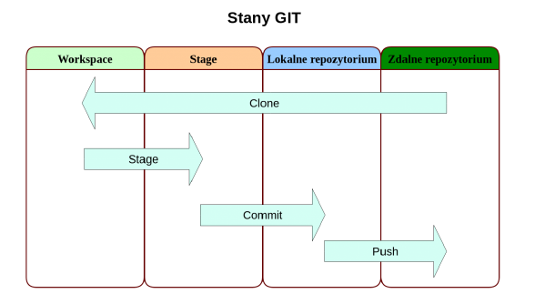
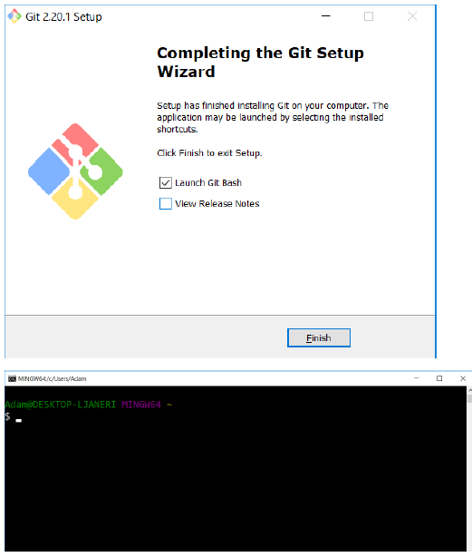
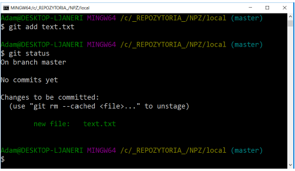

# GIT version control system

## Contents:
### 1. Introduction
   1.1. Linus Torvalds – creator of the GIT system\
   1.2. The most important features of GIT\
   1.3. File states in GIT\
   1.4. Terminology\
   1.5. GITA objects\
   1.6. GitBash
### 2. GIT installation
### 3. Git Bash Console
   3.1. GIT configuration\
   3.2. Logging changes to the repository\
   3.2.1. Checking the status of files in the repository\
   3.2.2. Tracking new files\
   3.2.3. Adding changes to the waiting room\
   3.2.4. Preview of changes made\
   3.2.5. Committing changes\
   3.2.6. Change history\
   3.3. Extended mechanisms\
   3.3.1. Undoing changes\
   3.3.2. Source tagging\
   3.3.3. Ignoring files\
   3.4. Branches in Git\
   3.4.1. Branching project history\
   3.4.2. Merge branches\
   3.4.3. Merge conflicts\
   3.5. Working with a remote repository [remote]\

  
## 1. Introduction

Version control system - software used to track changes mainly to source code and to help programmers combine changes made to files by many people at different times.

### 1.1. Linus Torvalds – creator of the GIT system
GIT is a version control system that is free and open source. It was designed with many people working on one code at the same time.
GIT was created by Linus Torvalds as a tool to support the development of the Linux kernel because all existing (free) version control systems were insufficient. This system was supposed to be distributed, fast, protect against errors in the repository and not have the disadvantages of CVS.
Work on Git began on April 3, 2005, the project was announced on April 6, on April 7 Git supported version control of its own code, on April 18 the merging of several code branches was performed for the first time, on April 27 Git was tested for speed with a result of 6.7 patches per second, and on June 16, Linux 2.6.12 was hosted by Git.
As you can see, a fully functional version control system was created in less than a month. And the father of this success is, of course, Linus Torvalds himself, who did most of the project himself!

### 1.2. The most important features of GIT
The most important features of the GIT system include:
● Good support for branching software development: there are several algorithms available for combining changes from two branches, as well as the ability to add your own algorithms.

● Off-line work: each programmer has his own copy of the repository to which he can save changes without a network connection; changes can then be exchanged between local repositories.

● Support for existing network protocols: data can be exchanged via HTTP(S), FTP, rsync, SSH.

● Work effectively with large projects: Git, according to Torvalds and Mozilla Foundation tests, is orders of magnitude faster than some competing solutions.

● Support for non-linear programming (branches)

● Addressing by content (SHA-1)

### 1.3. File states in GIT
To work with GIT, you need to understand what states the files managed by the system may be in. Git introduces three main states for changes: modified, tracked, and committed.
● modified – the file has been edited, but the change has not been saved anywhere yet;

● tracked – the modified file has been marked for approval in the next commit operation;

● approved – the change made has been saved and persisted in the local database;

Sending changes to a remote repository is now an optional operation.

<br>

● Git directory – this is the core of the local repository. In it, Git stores metadata about files and an object database. This directory is copied when cloning the repository.

● working directory – this is a recreated image of the project version. It is the content of this directory that is modified by the user.

● storage (stage) – this is an intermediate place between the working directory and the local database. Thanks to it, you can save only selected changes.

### 1.4. Terminology
When working with GIT, we may encounter the following nomenclature:
● Branch - a parallel branch of the project developed separately from the main one.

● Tag – a marker of a specific version (SVN revision) of the project.

● Working Dir – working directory where we work

● Index – a type of "cache", i.e. a place where changes to the commit are kept

● Master Branch – the main branch with which we merge our changes before sending them to the remote repository.

● Development Branch – the branch on which feature branches are merged. When the next version is released, it is merged with the Master Branch.

● Feature Branch – a branch on which a specific tool or addition to the main project is developed.

● HotFix – a branch created for quick fixes, fixing incompatibilities or bugs.

### 1.5. GIT objects
● Commit – indicates tree and father, contains, for example, information such as author, date and content of the message.

● Tree – represents the state of a single directory (list of blobs and nested tree objects)

● Blob – contains the contents of the file without any additional structure

● Tag – indicates a specific commit and contains a description of the tag.

### 1.6. GitBash
**Git Bash** is a GIT console that enables fully functional repository management. Using appropriate console commands you can, among others: create a repository, add files, track changes, etc.
The most important Git Bash commands include:
● `git init [name]` – creates a new local repository.

● `git clone origin [link]` - clones the repository from a remote server to a computer.

● `git remote add origin [link]` – adds a remote repository to the local repository.

● `git add [file]` – adds all changed files to the staged area

● `git checkout --` . – removes all files from the staged area.

● `git branch [name]` – creates a new branch

● `git checkout –b [name]` – creates a new branch and sets it as the current branch.

● `git checkout [name]` – switches to the selected branch

● `git commit –m ‘title’ –m ‘description’` – creates a commit from files in the staged area with the selected title and description.

● `git push` – pushes local changes to a remote server

● `git pull` – pulls and joins changes from the remote server to the local server

● `git fetch` – fetches changes from the remote repository, but does not attach them to the working directory.

● `git merge` – combines changes from two different branches, paths, or changes downloaded from a remote repository using git fetch

● `git stash save [file]` – adds the changed file to the clipboard

● `git stash apply` – adds changes from the clipboard to the working directory.

## 2. GIT installation
Click **Next**:

<br>

Select the installation folder and click **Next**:

<br>

We select the components to be installed (leave the default ones) and click **Next**:

<br>

Creating a folder for Git in the **Start** menu:

<br>

We choose an editor for Git, e.g. **Notepad++**:

<br>

We choose the settings of the **PATH** environment variable:

<br>

We select network settings for **Git**:

<br>
<br>

We choose the line break settings for text files:

<br>

We choose the terminal:

<br>

Additional options (default):

<br>

Installation:

<br>

We finish the installation and run **Git Bash**:

<br>

## 3. Git Bash Console

## 3.1. GIT configuration
GIT configuration comes down to setting the username, e-mail address and repository initialization.
The following commands are used for this purpose:
```
git config --global user.name "Your name and surname"
git config --global user.email your@email.com
git init
```

These commands should be invoked in the directory where we want to create the repository.

<br>

As a result, a hidden **.git** directory containing GIT configuration files was created in the selected folder.

<br>

`TASK`
Create a directory on your desktop called my_repository and initialize it as a GIT repository.

## 3.2. Logging changes to the repository
Registering changes in the repository is divided into several stages directly related to the life cycle of changes.
### 3.2.1. Checking the status of files in the repository
To check the status of files in the repository (status), use the following command:
```
git status
```
<br>
As you can see, there are no files in our repository that are tracked.

`TASK`

Create a new text file text.txt in the repository directory and save the text Ala has a cat in it. Then check the status of the files in the repository.
As a result of the actions performed, we receive the following message:

<br>

GIT has detected that we have added a new file and warns us that it is not yet tracked by the repository.

### 3.2.2. Track new files
To start tracing our file we will use the command
```
git add
```
Command syntax:
● `git add text.txt` – adds one selected file

● `git add` -A – adds all untracked files

● `git add` . – adds the current directory with all files and directories in it to the trace

<br>

As you can see, the status of the **text.txt** file has changed.

`TASK`

Add the **text.txt** file to tracking and then check the repository status.

### 3.2.3. Adding changes to the waiting room
As previously written, GIT operates on individual changes, not on files. This is very visible when adding files to the waiting room.

`TASK`

Modify the **text.txt** file by adding another line of text: The cat has Ala. Then check the status of the files in the repository.
Calling git status again shows that the **text.txt** file is in two sections at the same time:

<br>

This happens because GIT puts the file in the waiting room in the exact version it was in when the git add command was run. If the git commit command is run at this point, the version from the waiting room will be committed, not the one visible in the working directory.
To update a file in the waiting room, you simply need to add it again using `git add`.

<br>

The use of the waiting room in the process of approving changes offers enormous possibilities, thanks to which you can choose which specific modifications you want to approve and save in the repository.

`TASK`

Update the **text.txt** file by running the `git add` command. Check file status.

### 3.2.4. Preview of changes made
This is a very important functionality. Before committing changes, it is always worth verifying that everything went according to plan. It may happen that the changes were made in the wrong place or there were some additional generated files that we do not want to be saved in the repository. By verifying changes in the preview, you can avoid these types of errors.
The git status command will only provide information about which files have been modified, but with git diff you can see these changes in detail.
● difference between working directory and waiting room – `git diff`
● difference between waiting room and repository – `git diff --cached`
`TASK`

<br>

Check the operation of the commands from point 3.2.4

### 3.2.5. Approve changes
Once we are sure that the changes we have made are correct, we can save them to the local repository. For this purpose we will use the command
```
git commit
```
Invoking the command without any arguments will first launch the default text editor to provide comments for the changes being committed.
Optionally, you can provide a comment as an argument when running the command:
```
git commit -m "comment"
```
Once confirmed, the changes will be saved to the repository as a new snapshot.

<br>

### 3.2.6. change history
To view the change history, use the command:
```
gitlog
```
By default, the log displays changes from the newest to the oldest without providing any arguments.

<br>

The log command is very extensive and contains many configuration options, their full list can be found using the help:
```
git help log
```
One of the most useful options is -p. It shows the differences introduced with each revision. Additionally, you can use the -2 option to limit the set to the last two entries:

<br>

The option resulted in the display of the same information, with the difference that the so-called diff, i.e. difference. This is especially useful when reviewing code or quickly reviewing changes made by colleagues. Additionally, you can use a whole series of options summarizing the result of git log. For example, to see summary statistics for each committed change, use the --stat option:

<br>

--since and --until are also useful options. They introduce time limits for displayed logs, e.g. displaying information about changes made in the last dozen or so minutes:

<br>

This command supports many formats - you can specify a specific date (e.g. "2008-01-15") or provide a relative date such as 2 years 1 day 3 minutes ago.
You can also filter the list, leaving only the commits that meet the appropriate search criteria. The --author option allows you to select by a specific author, and the --grep option allows you to search by keywords contained in change notes.

<br>
<br>

If we need to specify both the author and the keywords, we must add the --all-match option - otherwise the command will match only according to one of the criteria.

<br>

`TASK`

Create another file **text2.txt** and add it to the repository and commit the changes (any comment). Then modify the **text2.txt** file with the text: There is a locomotive at the station. Add changes (add). Add another line of text in the file **text2.txt**: Heavy, huge and sweat flows from it - oily oil. Add changes and commit. Test the git log command with the various options mentioned in this section.

## 3.3. Extended mechanisms
### 3.3.1. Undoing changes
Rollback commits can be used to roll back changes that have already been pushed to the remote repository. This mechanism does not modify the history, but generates a commit, which is the opposite of the change we want to roll back. The command for this is:
```
git revert [options]
```

<br>

The above call undoes the last commit in the HEAD revision.

`TASK`

Add another line of text to the **text2.txt** file: chop, chop. Add changes and commit. Then add one more line: the locomotive is leaving and also add the changes and commit. Next, roll back the last 2 commits and check the contents of the **text2.txt** file.
Delete the **text.txt** file and commit the changes by executing the add and commit commands. Then roll back the last commit and check the contents of the repository. Check the change history in the repository.

### 3.3.2. Source tagging
Source tagging is a mechanism that allows you to mark more important places in the project's change history. It is most often used to mark the application version (e.g. version 3.1.5, etc.). Git has two types of labels: light and descriptive. Light weight will be important for us.
To mark current sources with a new tag, enter the command:
```
git tag [tag-name]
```
However, the git tag command itself, without providing any arguments, will display a list of all known tags.

`TASK`

Create a label for the current version of the repository. Then make some changes to the repository along with the commits and tag each commit. View a list of tags.

### 3.3.3. Ignoring files
In most projects we deal with files that we do not want to version. These are, for example, automatically generated files. Adding them to the repository only obscures the picture of the changes being made.
It is true that you can omit these types of files when committing changes, but this is not a very pragmatic approach. A much better solution is to mark such a file class as ignored. From this point on, they won't even be visible as modified files.
The file ignore mechanism is based on the **.gitignore** text file. Below is sample content:
```
*.tmp #comment
Tmp #comment2
```
We enter subsequent classes of ignored files in separate lines. The first line is responsible for ignoring all files with the .tmp extension, while the second one is responsible for the entire tmp directory and its contents.
It is worth defining at the very beginning which files are to be ignored. This will allow you to avoid messing with unnecessary files in the future.
Since the **.gitignore** file is a plain text file stored in the root directory of the repository, it can also be versioned. After adding or modifying it, it is worth committing the changes or marking it for ignoring.

`TASK`

Create a **.gitignore** file and put several file extensions in it (e.g. *.tmp, *.inf) and a directory, e.g. temp. Make a commit. Then add 1 file with each ignored file to the repository
extensions and a directory specified to be ignored. There should be several files in this directory. Check the status of the repository, i.e. whether there are any changes seen by GIT.

## 3.4. Gałęzie w Gicie
Rozgałęzianie projektu (np. kodu programu) to jedna z ważniejszych funkcjonalności GITa. Praca z gałęziami (branch) jest bardzo szybka, w odróżnieniu od innych podobnych rozwiązań. Gałąź w Gicie została zaimplementowana jako lekki, przesuwalny wskaźnik na miejsce w historii.
Domyślna nazwa gałęzi to master. Do tej pory pracowaliśmy tylko na niej. Pracując na kilku branchach system musi wiedzieć, na którym aktualnie się znajdujemy, w tym celu wprowadzono wskaźnik HEAD.
Do tworzenia nowych gałęzi służy polecenie:
```
git branch [nazwa-brancha]
```
Aby zobaczyć listę gałęzi należy użyć polecnia:
```
git branch --list
```

<br>

Branch master został oznaczony gwiazdką oraz kolorem zielonym. Jest to wskaźnik HEAD oznaczający, że aktualnie znajdujemy się na tej gałęzi.
Plecenie git branch nie zmienia aktualnego brancha, tylko tworzy nowy. W celu zmiany aktualnego brancha należy wywołać komendę:
```
git checkout [nazwa-brancha]
```

<br>

As you can see, the name of the active branch is also displayed in parentheses at the end of the path before the prompt.

`TASK`

Create a new branch called new_branch. Go to the newly created branch. Then create a text file n_branch.txt and save the text in it: New branch. Apply the changes made to the repository (add a file and commit).
### 3.4.1. Branching out the design story
Sometimes there is a need to fork the project's history in order to be able to, for example, develop new functionality on a separate branch without disturbing others in their work. The changes introduced in this way are independent of each other, they are connected only by a common point in history.
To better demonstrate this, a new feature branch will be created to which the new functionality will be introduced, and a quick hotfix will be added to the master branch.
It is generally accepted practice to develop new, unstable functionalities on separate branches to maintain the greatest possible stability of the main master branch.
### 3.4.1.1. New functionality
In our example, the new functionality will consist in adding a new line of text to the feature.txt file. Since this file does not exist, we need to create it in the master branch and create a change history for it by modifying its content.

`TASK`

In the master branch, create a new file called feature.txt and put the text in it: Line 1. Add the file to the repository and commit the changes. Then add the text in new lines of this file: Line 2 and Line 3. Confirm all changes again.
Create a new branch called feature and switch to it. Add a line of text to the feature.txt file: Functionality in the feature branch. Commit changes. (See figure below).

<br>

Instead of 2 commands:
```
git branch feature
git checkout feature
```
you can use one that simultaneously creates a new branch and goes to it:
```
git checkout -b feature
```

### 3.4.1.2. Quick Hot Fix
When working on a new functionality, it may happen that, for example, an error is detected in the basic version of the project (which is already working and used by the client) and it will be necessary to make corrections. However, the functionality in the feature branch is in a phase where it is impossible to complete it. Therefore, we cannot make the desired corrections and finish the feature branch (merge with master). In such a case, we switch to the master branch where the new functionality is not yet available and make the necessary corrections there.
Thanks to this, we have a working version in the master branch with the corrections made, and we can safely continue working on the new functionality in the feature branch.

`TASK`

Switch to branch master, add a line of text in the feature.txt file: HotFix. This line should be between lines 1 and 2. Commit the changes.

<br>

### 3.4.2. Merging branches
A fix has been made to our main project branch and you can safely get back to work on project development. However, we would like to work with the latest sources possible, so we also need the changes that have been made in the master branch.
One possible way to achieve this is to **merge** the master branch into the feature branch. To do this, we go to the feature branch and run the command
```
git merge master
```

<br>

We managed to automatically transfer all changes from master to feature. However, sometimes conflicts may arise, but we will come back to this.
We are finishing developing the new functionality. Now you can commit the finished functionality and merge it to the master branch.

`TASK`

While in the feature branch, add the following line of text to the end of the feature.txt file: End of feature functionality. Commit changes. Merge the feature branch with the master branch using the command:
```
git merge feature
```
NOTE: This command must be executed after switching to the master branch.

<br>

All changes have been applied to the master branch. This time, however, there was no merge commit because git could use the Fast-forward mechanism. This happened because when merging changes, all you had to do was move the branch pointer and you didn't have to do a full merge of the changes.
After merging the branch with the new functionality, you can delete it:

<br>

As you can see in the image above, only the master branch remains.
### 3.4.3. Merge conflicts
However, merging branches does not always go smoothly. We then have code conflicts that need to be resolved. This most often happens if a given piece of code will be edited on both branches.

`TASK`

In the master branch, create a main.cpp file and put the code in it:
```
int a = 2;
int b = 3;

int main(void)
{
   if(a+b>5)
     return 1;
   else
     return 0;
}
```
Add the changes to the repository and commit them. Create a new branch called my_branch (don't go to it, stay in master!)
Then modify the code by assigning the value 4 to the b variable and commit as shown in the figure below:

<br>

Go to the my_branch branch and modify the program code by assigning the value 0 to the b variable. Make a commit:

<br>

Staying in the my_branch branch, merge it with the master branch:

<br>

A conflict occurred while trying to automatically merge and we will have to manually merge the changes. Let's check the status of the repository:

<br>

We receive more information about the conflict, including: that it concerns the main.cpp file. Additionally, the content of the conflict file has changed:

<br>

GIT placed code from both branches between special tags.
Now you need to resolve the conflict by correcting the code and committing it to the repository. You also need to remove tags added during merge.
Moving a file to the waiting room means that the conflict is resolved in Git.

`TASK`

Resolve the conflict that occurred during merge by leaving the line of code with the value b=4 and removing unnecessary lines in the main.cpp file. Commit changes and check the repository status:

<br>

### 3.4.3.1. Graphical conflict resolution tools (mergetool)
It is also possible to resolve conflicts using graphical tools. Instead of editing files manually, just run the commands:
```
git config –global merge.tool kdiff3
gitmergetool
```
The first command sets the default editor to kdiff3, and the second command invokes it. You can also use another tool, e.g.: opendiff, kdiff3, tkdiff, xxdiff, meld, tortoisemerge, gvimdiff, diffuse, diffmerge, ecmerge, p4merge, codecompare, emerge, vimdiff.
After resolving the conflict and saving the files using the selected tool, you can commit the changes.

## 3.5. Working with a remote repository [remote]
By using the capabilities of a remote repository, you can collaborate with other people and are no longer limited to working on one computer. Git allows you to work with several different remote repositories at the same time. You can download code from them, submit your changes, manage code branches, etc.

### 3.5.1. View remote repositories
To list all configured remote repositories, use the command:
```
git remote
```
or to view more information about remote repositories:
```
git remote -v
```

<br>

### 3.5.2. Adding a remote repository
Configuring a new remote repository involves issuing a command in the general format:
```
git remote add [shortcut] [url]
```
From now on, the new remote repository is linked to our local one.

<br>

View information about a remote repository:
```
git remote show [shortcut]
```

<br>

### 3.5.3. Downloading changes from the global repository
Please note that **pulling changes from the remote repository and linking them to the local repository are two completely independent activities.**
Recommendation
```
git fetch [shortcut]
```
downloads all changes that have not yet been made locally.
After executing this command, the contents of the local repository have not changed - GIT has not yet modified the local copy of the repository. It is still necessary to apply the downloaded changes to the local repository. For this purpose, you can use merge:
```
git merge [shortcut]/[branch]
```

<br>

At this point, of course, conflicts may arise, but their resolution is the same as when merging local branches.
The above two steps are usually performed immediately after each other, so they have been combined into one command:
```
git pull [shortcut] [branch]
```
This command is equivalent to downloading the latest changes from the global repository, the short name of which should be given in place of [shortcut] - and merging them into the local branch (the branch name must be indicated).

<br>

### 3.5.4. Sending local changes to the global repository
If changes have been made to the local version of the repository and we want to send them externally (to the global repository), we will use the command:
```
git push [shortcut] [branch]
```

<br>

Overwriting the changes in the remote repository will only succeed if no one has added their changes since the last time the changes were downloaded from outside. If this has already happened, we must first download such changes and combine them with our own.

### 3.5.5. Cloning a remote repository
If we want to obtain a copy of an existing GIT repository - for example, a project in which we want to start contributing and introduce our own changes - the necessary command will be
```
git clone [url]
```
After executing the git clone command, every revision of every file in the project history will be downloaded. In practice, even if the server disk is damaged, we can use any of the available clones to restore the server to the state it was in at the time of cloning.

<br>

### 3.5.6. Initializing the remote repository
The command is used to initialize the remote repository
```
git init --bare [path]
```
<br>

The above command creates the remote repository directory along with its appropriate contents.
If we are in a directory that is to be a remote repository, we do not provide the path.
To better understand what a remote repository is and how it works, we will create 3 directories - the first one will act as our remote repository, and the other two will be local repositories. As you can easily see, all directories will be located on the same computer, which will also act as a server and a local computer.
